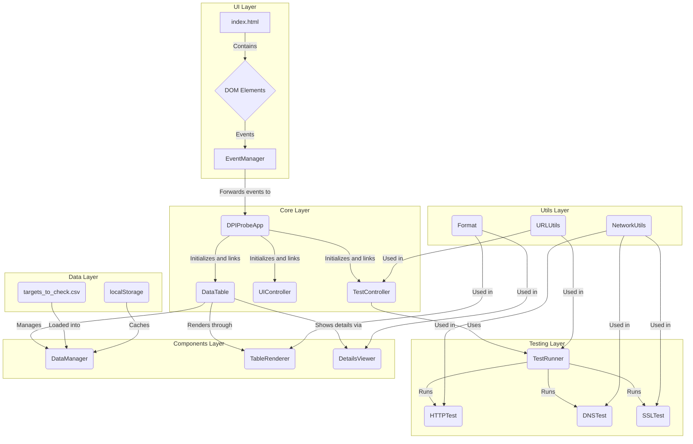

# DPI Probe Project Architecture and Functionality

This document describes the architecture, key components, and operational principles of the DPI Probe application.

## Architecture Overview

The application is built with "vanilla" JavaScript without any frameworks and follows a modular design. All components are divided into logical groups: core, tests, UI components, and utils.

## Key Modules

-   **`DPIProbeApp` (`js/core/app.js`)**: The central class that initializes all modules, controllers, and establishes connections between them.
-   **`AppInitializer` (`js/core/app-initializer.js`)**: Ensures that all components are initialized only after the DOM is fully loaded. It is critical for handling the loading of `targets_to_check.csv`.
-   **`TestController` (`js/core/test-controller.js`)**: Manages the test execution logic. It receives requests from `DPIProbeApp` and uses `TestRunner` to execute them.
-   **`TestRunner` (`js/tests/test-runner.js`)**: The test orchestrator. For a given target (URL or IP), it sequentially runs HTTP, DNS, and SSL tests.
-   **`DataTable` (`js/components/data-table.js`)**: Manages the state and rendering of the main results table.
-   **`DataManager` (`js/components/data-manager.js`)**: Responsible for loading data from `targets_to_check.csv` and caching it in `localStorage`.
-   **`NetworkUtils` (`js/utils/network.js`)**: **A key module** that implements the logic for network checks.

---

## Anomaly Detection Principles

The application cannot directly detect DPI, but it identifies **symptoms of interference** in network traffic by using clever workarounds for browser limitations.

### 1. DNS Test (Detecting DNS Spoofing and Substitution)

-   **Problem**: Standard DNS queries from the browser or OS can be easily intercepted and modified by an ISP's DPI system, which might return the IP address of a phishing site or a block page.
-   **Solution**: `NetworkUtils.resolveDNS` **does not use the system DNS**. Instead, it sends encrypted queries directly to independent public **DNS-over-HTTPS (DoH)** servers (e.g., Cloudflare and Google).
-   **Analysis**:
    1.  **DoH Queries**: Since DoH traffic is encrypted, intercepting and modifying it is extremely difficult. The IP addresses obtained are considered the "ground truth."
    2.  **Reverse DNS (PTR)**: For each IP address received, a reverse DNS query is performed to find out the domain name it corresponds to.
    3.  **Spoofing Detection**: The `_isDnsSpoofed` logic compares the base domains derived from the PTR records from different DoH servers (e.g., Google and Cloudflare). If the PTR records for IPs from Google point to `*.google.com`, while IPs from Cloudflare point to `*.custom-cdn.net`, and these domain zones do not overlap, it is a strong indicator of DNS spoofing.

### 2. SSL/TLS Test (Detecting MITM Attacks and Black Holes)

-   **Problem**: To analyze HTTPS traffic, DPI systems often use a "Man-in-the-Middle" (MITM) attack, replacing the original SSL certificate with their own. Another blocking method is a "black hole," where packets to a resource are simply dropped.
-   **Solution**: `NetworkUtils.checkSSL` uses `fetch` to request an `https://` resource with two key mechanisms:
    -   **`fetch` Error Analysis**: If `fetch` **throws an exception** (`TypeError: Failed to fetch`), it strongly indicates a problem with the certificate (it's invalid, revoked, or substituted), which is a primary sign of a MITM attack. If `fetch` **completes successfully**, the certificate is trusted.
    -   **Timeout and `AbortController`**: The request is wrapped in an `AbortController` with a 15-second timeout (`BLACK_HOLE_THRESHOLD_MS`). If no response is received within this time, the request is forcibly aborted. This allows the detection of "black holes" where the server is unresponsive.
-   **Conclusion**: This test verifies not only the integrity of the SSL certificate but also the network-level accessibility of the resource.

---

## Data Flows

### 1. Running All Tests

1.  The **user** clicks "Run All Tests."
2.  `EventManager` catches the event and calls `DPIProbeApp.runAllTests()`.
3.  `DPIProbeApp` delegates the task to `TestController.runAllTests()`.
4.  `TestController` gets all rows from `DataTable` and sequentially starts a check for each one.
5.  For each row, `TestController` calls `TestRunner.runSingleTest()`, which executes the HTTP, DNS, and SSL tests.
6.  The results are returned to `TestController`, which updates the data in `DataTable`.
7.  `DataTable` updates `localStorage` via `DataManager` and redraws the corresponding row in the table via `TableRenderer`.

### 2. Manual URL Check

1.  The **user** enters a URL and clicks "Check."
2.  `EventManager` -> `DPIProbeApp.checkSingleUrl()`.
3.  `DPIProbeApp` gets the URL and passes it to `TestController.checkSingleUrl()`.
4.  `TestController` uses `TestRunner` to perform a full set of tests.
5.  The result is passed to `ResultViewer`, which displays a summary card below the input field.
6.  If the user clicks "Add to Table," `ResultViewer` calls `TestController.addTestResultToTable()` via `DPIProbeApp`.
7.  `DataTable` adds a new row and redraws the table.
