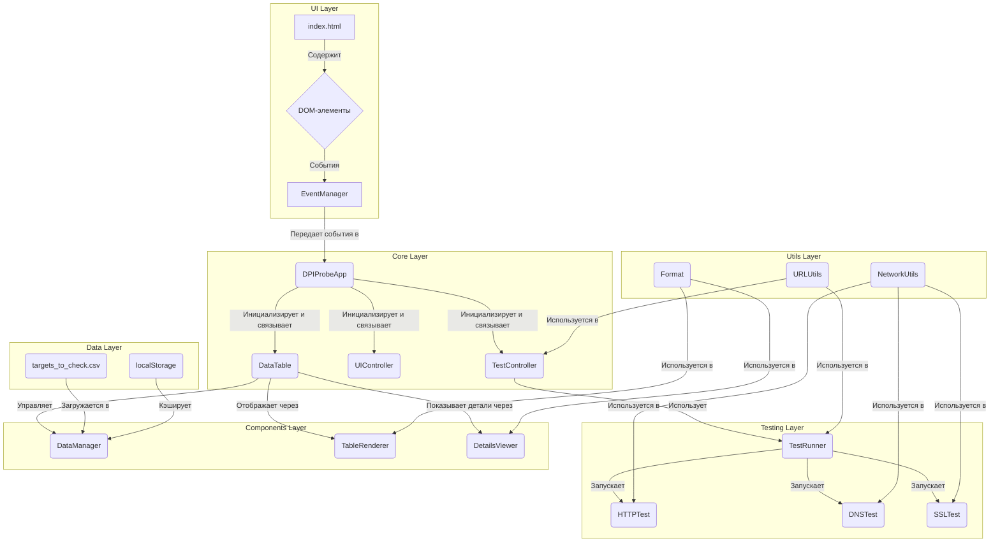

# Архитектура и функциональность проекта DPI Probe

Этот документ описывает архитектуру, ключевые компоненты и принципы работы приложения DPI Probe.

## Обзор архитектуры

Приложение построено на "ванильном" JavaScript без использования фреймворков и следует модульному принципу. Все компоненты разделены на логические группы: ядро (`core`), тесты (`tests`), UI-компоненты (`components`) и утилиты (`utils`).

## Ключевые модули

-   **`DPIProbeApp` (`js/core/app.js`)**: Центральный класс, который инициализирует все модули, контроллеры и устанавливает связи между ними.
-   **`AppInitializer` (`js/core/app-initializer.js`)**: Гарантирует, что все компоненты будут инициализированы только после полной загрузки DOM. Критически важен для обработки загрузки `targets_to_check.csv`.
-   **`TestController` (`js/core/test-controller.js`)**: Управляет логикой выполнения тестов. Принимает запросы от `DPIProbeApp` и использует `TestRunner` для их выполнения.
-   **`TestRunner` (`js/tests/test-runner.js`)**: Оркестратор тестов. Для заданной цели (URL или IP) он последовательно запускает HTTP, DNS и SSL тесты.
-   **`DataTable` (`js/components/data-table.js`)**: Управляет состоянием и отображением основной таблицы с результатами.
-   **`DataManager` (`js/components/data-manager.js`)**: Отвечает за загрузку данных из `targets_to_check.csv` и их кэширование в `localStorage`.
-   **`NetworkUtils` (`js/utils/network.js`)**: **Ключевой модуль**, реализующий логику сетевых проверок.

---

## Принципы обнаружения аномалий

Приложение не может напрямую детектировать DPI, но оно выявляет **симптомы вмешательства** в сетевой трафик, используя умные обходные пути для ограничений браузера.

### 1. DNS-тест (Обнаружение DNS-спуфинга и подмены)

-   **Проблема**: Стандартные DNS-запросы от браузера или ОС могут быть легко перехвачены и изменены DPI-системой провайдера, которая может вернуть IP-адрес фишингового сайта или страницы-заглушки.
-   **Решение**: `NetworkUtils.resolveDNS` **не использует системный DNS**. Вместо этого он отправляет зашифрованные запросы напрямую к независимым публичным **DNS-over-HTTPS (DoH)** серверам (например, Cloudflare и Google).
-   **Анализ**:
    1.  **DoH-запросы**: Так как DoH-трафик зашифрован, его перехват и модификация крайне затруднительны. Полученные IP-адреса считаются "эталонными".
    2.  **Обратный DNS (PTR)**: Для каждого полученного IP-адреса выполняется обратный DNS-запрос, чтобы узнать, какому доменному имени он соответствует.
    3.  **Обнаружение спуфинга**: Логика `_isDnsSpoofed` сравнивает базовые домены, полученные из PTR-записей от разных DoH-серверов (например, Google и Cloudflare). Если у IP-адресов, полученных от Google, PTR-записи указывают на `*.google.com`, а у IP от Cloudflare — на `*.custom-cdn.net`, и эти доменные зоны не пересекаются, это являет��я сильным признаком DNS-спуфинга.

### 2. SSL/TLS-тест (Обнаружение MITM-атак и "черных дыр")

-   **Проблема**: Для анализа HTTPS-трафика DPI-системы часто используют атаку "человек посередине" (MITM), подменяя оригинальный SSL-сертификат своим. Другой метод блокировки — "черная дыра" (black hole), когда пакеты к ресурсу просто отбрасываются.
-   **Решение**: `NetworkUtils.checkSSL` использует `fetch` для запроса к `https://` ресурсу с двумя ключевыми механизмами:
    -   **Анализ ошибок `fetch`**: Если `fetch` **выбрасывает исключение** (`TypeError: Failed to fetch`), это с высокой вероятностью указывает на проблему с сертификатом (он невалиден, отозван или подменен), что является главным признаком MITM-атаки. Если `fetch` **завершается успешно**, значит, сертификат доверенный.
    -   **Таймаут и `AbortController`**: Запрос оборачивается в `AbortController` с таймаутом в 15 секунд (`BLACK_HOLE_THRESHOLD_MS`). Если за это время ответ не приходит, запрос принудительно прерывается. Это позволяет детектировать "черные дыры", когда сервер не отвечает.
-   **Вывод**: Этот тест проверяет не только целостность SSL-сертификата, но и саму доступность ресурса на сетевом уровне.

---

## Потоки данных (Data Flows)

### 1. Запуск всех тестов

1.  **Пользователь** нажимает "Запустить все тесты".
2.  `EventManager` ловит событие и вызывает `DPIProbeApp.runAllTests()`.
3.  `DPIProbeApp` делегирует задачу `TestController.runAllTests()`.
4.  `TestController` получает все строки из `DataTable` и последовательно для каждой запускает проверку.
5.  Для каждой строки `TestController` вызывает `TestRunner.runSingleTest()`, который выполняет HTTP, DNS и SSL тесты.
6.  Результаты возвращаются в `TestController`, который обновляет данные в `DataTable`.
7.  `DataTable` обновляет `localStorage` через `DataManager` и перерисовывает соответствующую строку в таблице через `TableRenderer`.

### 2. Ручная проверка URL

1.  **Пользователь** вводит URL и нажимает "Проверить".
2.  `EventManager` -> `DPIProbeApp.checkSingleUrl()`.
3.  `DPIProbeApp` получает URL, передает его в `TestController.checkSingleUrl()`.
4.  `TestController` использует `TestRunner` для выполнения полного набора тестов.
5.  Результат передается в `ResultViewer`, который отображает карточку с итогами под полем ввода.
6.  Если пользователь нажимает "Добавить в таблицу", `ResultViewer` через `DPIProbeApp` вызывает `TestController.addTestResultToTable()`.
7.  `DataTable` добавляет новую строку и перерисовывает таблицу.
